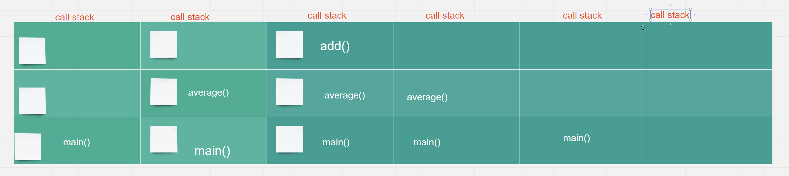

# Javascript Call Stack

What is a ‘call’?
- Invocation of a function

How many ‘calls’ can happen at once?
- One at a time

What does LIFO mean?
- Last in First out

Draw an example of a call stack and the functions that would need to be invoked to generate that call stack.

What causes a Stack Overflow?
- When a recursive function has no exit point.

# JavaScript error messages
What is a ‘refrence error’?
- When you try to use a variable that is not yet declared or not declared at all.

What is a ‘syntax error’?
- When something cannot be parsed because of syntax

What is a ‘range error’?
- RangeError is thrown when trying to pass a value as an argument to a function that does not allow a range that includes the value.

What is a type error’?
- types  errors show up when the types (number, string and so on) you are trying to use or access are incompatible, like accessing a property in an undefined type of variable.

What is a breakpoint?
- A stopping or pause point in the program to debug using your debugger.

What does the word ‘debugger’ do in your code?
- Helps examine code and variables while the code is executign.